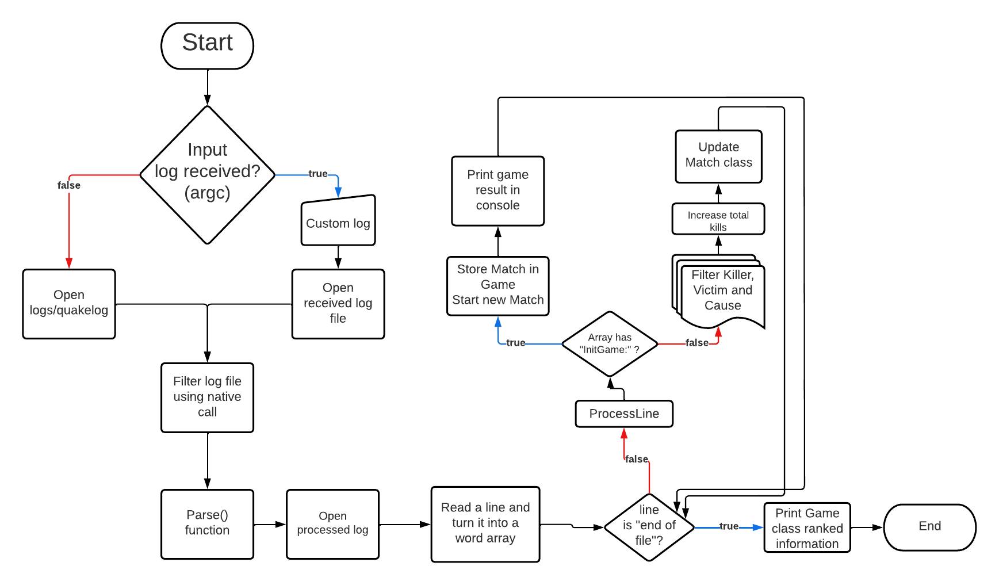

# My Log Parser
A Quake III log parser, written in C and C++.

## About the project:
This project was made as a test for a Quality Engineer position at CloudWalk, with the intent of measuring my general software engineering skills.

## Programming language choice:
- As a fan of John Carmack's magnum opus and its legacy, i could not write this parser on a language different than C++.
- Being a low level language, C++ code is faster as it gets compilled instantly to machine code, so its an efficient programming language for a parser.
- C++ programming expresses capability of troubleshooting and finding a root cause for errors, attributes which are, in my opinion, very important for the position.

## Input
My-Log-Parser will accept any quake3 log file as input, if opened without an initial input, it will open _quakelog_ at _logs_ folder.

## Output
After parsing, My-Log-Parser will create two .txt files, _causesofdeath.txt_ and _matchresults.txt_, respectively, the ranked causes of death of each match and the results from each match.

# Build Dependencies
- Ninja, which can be installed by chocolatey's "choco install ninja";
- CMake for build automation, downloaded on https://cmake.org/download/;
- G++ installed on PATH;

## Build commands 
1. "cd my-log-parser"
2. "cmake . -G Ninja"
3. "cmake --build ."

## Implementation plan
1. Use a OS native function to filter useful lines from the original log;
2. Compare string pointers from between non-variant parts of the log("Kill:", "killed" and "by");
3. Store substrings between those words in classes using c++'s OOP;
4. Manipulate information at will.
5. Print file with ranked information

## TODOs
- Adapt main function to receive multiple log files.
- Adapt algoryth to accept player names using non-variant words of the log.
- Create docker image.
